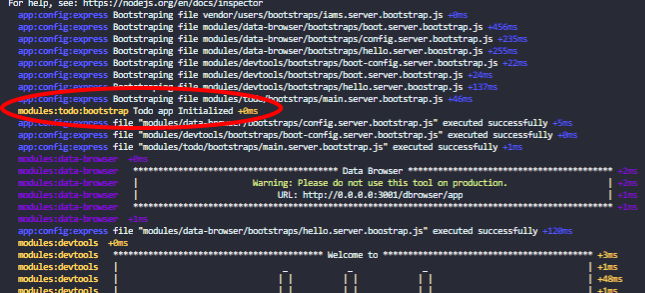

The bootstraps folder executes all the files you put in it on server startup, suitable for app initialization.

Under `/todo` create another folder called `bootstraps` and under that create a file called `main.server.bootsrap.js`.
your folder structure so far should look something like this
.

```bash
modules
└── todo
    └── bootstraps
        └── main.server.bootstrap.js
```

> the file name is important it must follow this pattern `<file-name>.server.bootstrap.js` in order for them to be picked up

Open the `main.server.bootsrap.js` in your text editor and start by exporting a function like this

```javascript title=modules/todo/bootstraps/main.server.bootstrap.js lineNumbers=true
// highlight-start
module.exports = (config, app, db) => {};
//highlight-end
```

This function takes in three parameters

1 - the application's configuration

2 - the express app object

3 - and the database

For the purposes of this tutorial we're not going to go into the details and instead we're just going to log something to the terminal.

Remove the parameters because we're not going to use them and require in [debug](https://www.npmjs.com/package/debug) and call it inside the function with the string "Todo app Initialized"

```javascript title=modules/todo/bootstraps/main.server.bootstrap.js lineNumbers=true
// highlight-start
const debug = require("debug")("modules:todo:bootstrap");
//highlight-end

module.exports = () => {
  // highlight-start
  debug("Todo app Initialized");
  //highlight-end
};
```

Now to test out our app go to the terminal and running

```bash
npm start
```

You'll see the app's startup message on the terminal



Next up, we'll setup our routes using IAMs
