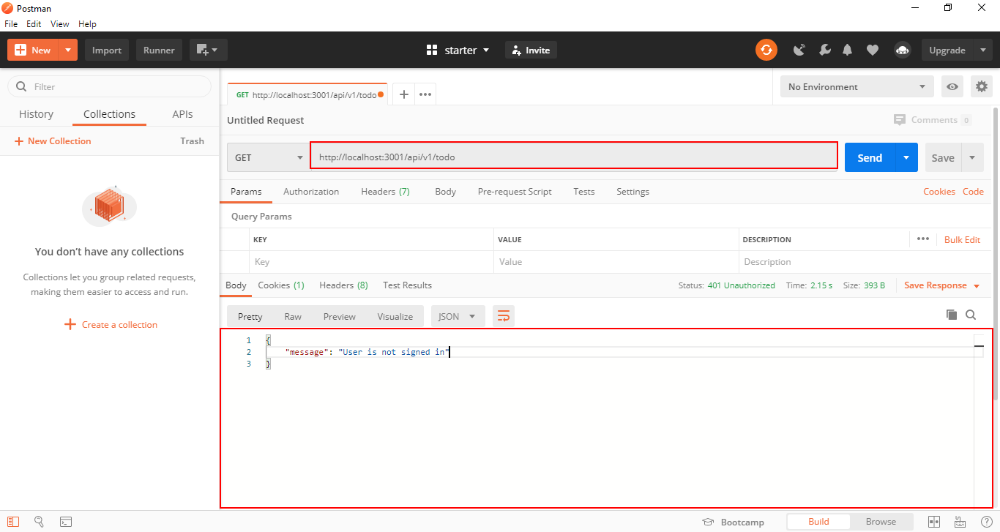

## IAM

[IAM](https://en.wikipedia.org/wiki/Identity_management) (Identity Access Management) plays the role of a wrapper around [express middlewares](https://expressjs.com/en/guide/using-middleware.html), IAM is a declarative way to make application routes, they also make it easy to make role-based privileges in your app.

In the `/todo` folder create a new folder called `iam`
and under `/iam` create a new file called `main.server.iam.js`

The folder structure so far should be looking like this:

```bash
modules
└── todo
    ├── bootstraps
    │   └── main.server.bootstrap.js
    └── iam
        └── main.server.iam.js
```

To declare a new route, you can use the provided snippet to automatically generate it, in your text editor on the `main.server.iam.js` if you're using [vscode](https://code.visualstudio.com/) text editor type `iam`
and then press `TAB`.

What IAM does is export an object with some properties:

- Prefix: the API endpoint routes prefix

- Routes: an array where we declare our API routes each route is an object where we can specify the `path` and the http methods to execute on that route

Our first route will have a `GET` request to list out our todos.

```javascript title=modules/todo/iam/main.server.iam.js lineNumbers=true
/**
 * @type { IAM.default }
 */
module.exports = {
  prefix: "/todo",
  routes: [
    {
      path: "/",
      methods: {
        get: {
          iam: "modules:todo:main:list",
          title: "List todo",
          groups: [],
          parents: ["modules:todo", "modules:todo:main"],
          description: "List available todo",
          middlewares: [(req, res) => res.json({ message: "Hello, world" })],
        },
      },
    },
  ],
};
```

To test out our app so far we will be using a popular http client called [Postman](https://www.postman.com/)

Open up postman and make a `GET` request to `http://localhost:<port-number>/api/v1/todo`



at First we'd get a response with a message saying "User is not signed in", Because by default to call our API we must be logged in but to make it simple for this tutorial, all we need to do now is to make the API public by simply going to `/config/lib/acl.js` and add the iam string to the guest array like the following:

```javascript title=config/lib/acl.js lineNumbers=true
/**
 * Guest role
 * @type  {Array}
 */
const guest = ["vendor:users:public", "modules:todo:main"];

/**
 * User role
 * @type  {Array}
 */

const user = [
  /**
   * Users IAMs
   */
  "vendor:users:user",
  "vendor:users:auth",
];
/**
 * Admin role
 * @type  {Array}
 */
const admin = [
  ...user,
  /**
   * Admin IAMs
   */
  "vendor:users:admin",
  "vendor:users:roles",
];
/**
 * All roles
 */
module.exports = [
  {
    name: "guest",
    protected: true,
    title: "Guest role",
    description:
      "Role given for any unauthenticated user, or users who don't have any role.",
    iams: guest,
  },
  {
    name: "user",
    protected: true,
    iams: user,
    title: "User role",
    description: "The default role.",
  },
  {
    name: "admin",
    protected: true,
    iams: admin,
    title: "Admin role",
    description: "Given to advanced users.",
  },
];
```

Now let's save and test our app again, it should work as intended now


We will discuss Roles and IAM in details the [next section](/roles)

Now let's make the rest of the routes necessary for our CRUD

```javascript title=modules/todo/iam/main.server.iam.js lineNumbers=true
/**
 * @type { IAM.default }
 */
module.exports = {
  prefix: "/task",
  routes: [
    {
      path: "/",
      methods: {
        get: {
          iam: "modules:todo:main:list",
          title: "List todo",
          groups: [],
          parents: ["modules:todo", "modules:todo:main"],
          description: "List available todo",
          middlewares: [(req, res) => res.json({message: "Hello, world"})],
        },
        {
        post: {
          iam: "modules:todo:main:create",
          title: "Create new task",
          groups: [],
          parents: ["modules:todo", "modules:todo:main"],
          description: "Create new task",
          middlewares: [(req, res) => res.json({message: "Hello, world"})],
        },
      }
      },
    }, {
    path: '/:taskId',
    methods: {
      get: {
        iam: 'modules:todo:main:one:get',
        title: 'Get task',
        groups: [],
        parents: ['modules:todo', 'modules:todo:main'],
        description: 'Get specific task',
        middlewares: [
          middlewares: [(req, res) => res.json({message: "Hello, world"})],
        ],
      },
      put: {
        iam: 'modules:todo:main:one:update',
        title: 'Update task',
        groups: [],
        parents: ['modules:todo', 'modules:todo:main'],
        description: 'Modify task',
        middlewares: [
          middlewares: [(req, res) => res.json({message: "Hello, world"})],
        ],
      },
      delete: {
        iam: 'modules:todo:main:one:remove',
        title: 'Remove task',
        groups: [],
        parents: ['modules:todo', 'modules:todo:main'],
        description: 'Remove an existing task',
        middlewares: [
          middlewares: [(req, res) => res.json({message: "Hello, world"})],
        ],
      },
    },
  }
  ],
};
```
