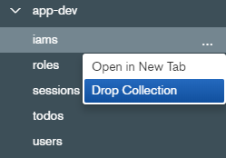
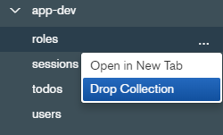
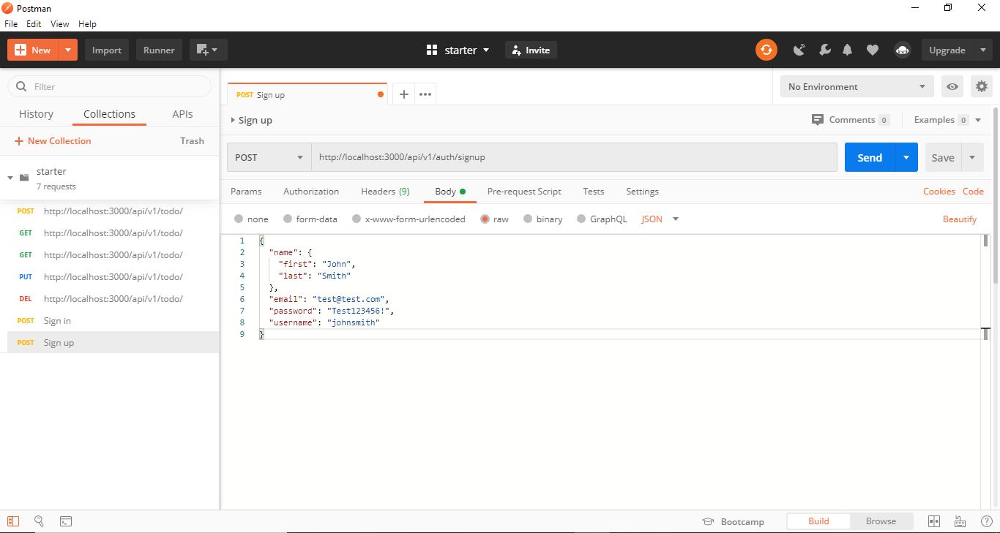
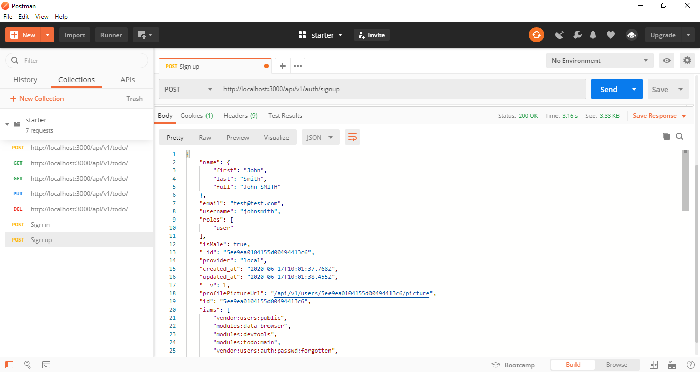
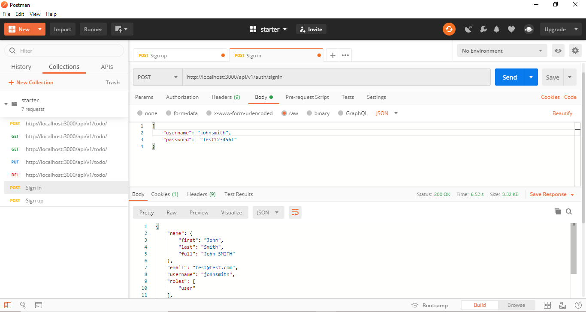
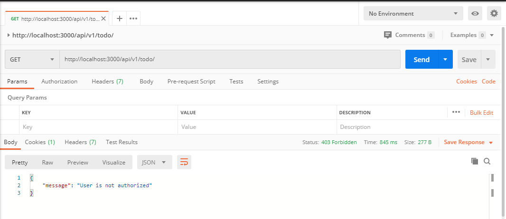
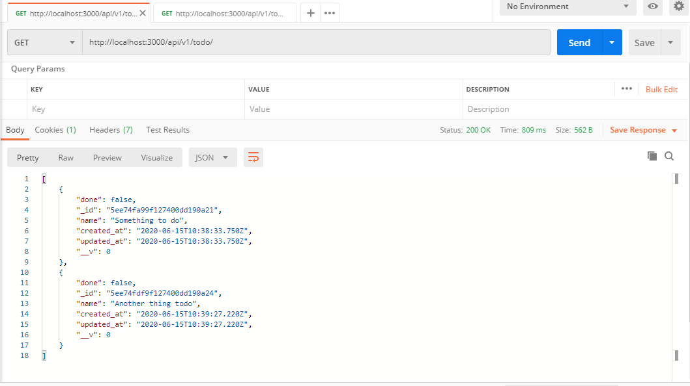

## Usage

izmjs comes with built-in roles, it uses IAM as seen in the [IAM section](/fm-tutorial/iam), in this section we'll dive into IAM and teach you how you can leverage it to easily add and manage roles in your application.
By default izmjs includes three basic roles:

```javascript title=config/lib/acl.js lineNumbers=true
/**
 * Guest role
 * @type  {Array}
 */
const guest = ["vendor:users:public", "modules:todo:main"];

/**
 * User role
 * @type  {Array}
 */

const user = [
  /**
   * Users IAMs
   */
  "vendor:users:user",
  "vendor:users:auth",
];
/**
 * Admin role
 * @type  {Array}
 */
const admin = [
  ...user,
  /**
   * Admin IAMs
   */
  "vendor:users:admin",
  "vendor:users:roles",
];
/**
 * All roles
 */
module.exports = [
  {
    name: "guest",
    protected: true,
    title: "Guest role",
    description:
      "Role given for any unauthenticated user, or users who don't have any role.",
    iams: guest,
  },
  {
    name: "user",
    protected: true,
    iams: user,
    title: "User role",
    description: "The default role.",
  },
  {
    name: "admin",
    protected: true,
    iams: admin,
    title: "Admin role",
    description: "Given to advanced users.",
  },
];
```

- Guest: Role given for any unauthenticated user, or users who don't have any role.

- User: The default role.

- Admin: Given to advanced users with more privileges.

```javascript lineNumbers=true
/**
 * @type { IAM.default }
 */
module.exports = {
  prefix: "/todo",
  routes: [
    {
      path: "/",
      methods: {
        get: {
          iam: "modules:todo:main:list",
          title: "List todo",
          groups: [],
          parents: ["modules:todo", "modules:todo:main"],
          description: "List available todo",
          middlewares: [cntrls.list],
        },
      },
    },
  ],
};
```

> As a convention iams must be named as the following: `"<containing-folder>:<child-folder>:file"` and the fourth component of the iam you're free to name it what you want, we name it according to the name of the controller.

every IAM has two very important properties:

- iam: a string containing the name of the iam

- parents: an array containing the parent iam that that particular iam belongs to as shown on the Venn diagram below


If a user has access to a parent, he has access to of the children, conversely if a user has access to a child he won't have access to the parents or the siblings if they're at the same level, if you want to give it access we need to add another iam for that particular sibling

## Managing Roles

First things first we need to do is to reset the roles for our application and start from scratch, let's start by deleting the Todo iam from the guest role

```javascript title=config/lib/acl.js lineNumbers=true
/**
 * Guest role
 * @type  {Array}
 */
//highlight-start
const guest = ["vendor:users:public"];
//highlight-end
```

And we need to also reset the roles from our mongoDB database by deleting the `iams` and `roles` collections





Next up is to setup Authentication for our application by creating a new user

## Authentication

IZM.js comes with an auth out of the box and the steps below show you how to register and sign-in a new user

1- to register a new User head to Postman and make a post request to this endpoint: `http://localhost:3000/api/v1/auth/signup`

2- Go to the Body tab set it raw and to JSON type object, and the request body required to create a new user is the following:

```json
{
  "name": {
    "first": "{{firstname}}",
    "last": "{{lastname}}"
  },
  "email": "{{email}}",
  "password": "{{password}}",
  "username": "{{username}}"
}
```



And If everything goes well you should get a response with your newly created user like the following



Now that our User has signed up we can sign him in by making a `POST` request to this enpoint `http://localhost:3000/api/v1/auth/signin`

Go to the Body tab set it raw and to JSON type object, and the request body required to sign in a new user is the following:

```json
{
  "username": "{{username}}",
  "password": "{{password}}"
}
```



Congratulations we've successfully created and signed in a new user, up next is managing roles using iam

## Authorization

Now that our user is signed let's try and make `GET` request to get the list of todos



Hmmm Bummer, it says that the user isn't authorized... Well, it makes sense because we haven't setup our iam for the user yet, now let's go ahead and assign to the user the iam that allows him to get the list of the todos, and it is as simple as putting the `"modules:todo:main:list"` iam in the user iam array.

```javascript title=config/lib/acl.js lineNumbers=true
/**
 * Guest role
 * @type  {Array}
 */
const guest = ["vendor:users:public"];

/**
 * User role
 * @type  {Array}
 */

const user = [
  /**
   * Users IAMs
   */
  "vendor:users:user",
  "vendor:users:auth",
  // highlight-start
  "modules:todo:main:list",
  // highlight-end
];
```

Okay now that we gave the user the right to list todos, let's try it out in Postman



> Remember the User only has access to the list todos endpoint, if you want to give him access to the whole API you need to assign him the iam `"modules:todo:main"`
