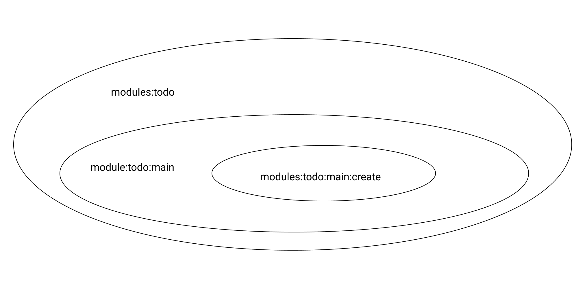

## Usage

izmjs comes with built-in roles, it uses IAM as seen in the [IAM section](/fm-tutorial/iam), in this section we'll dive into IAM and teach you how you can leverage them to easily add and manage roles in your application.
By default izmjs includes three basic roles:

```javascript title=config/lib/acl.js lineNumbers=true
/**
 * Guest role
 * @type  {Array}
 */
const guest = ["vendor:users:public", "modules:todo:main"];

/**
 * User role
 * @type  {Array}
 */

const user = [
  /**
   * Users IAMs
   */
  "vendor:users:user",
  "vendor:users:auth",
];
/**
 * Admin role
 * @type  {Array}
 */
const admin = [
  ...user,
  /**
   * Admin IAMs
   */
  "vendor:users:admin",
  "vendor:users:roles",
];
/**
 * All roles
 */
module.exports = [
  {
    name: "guest",
    protected: true,
    title: "Guest role",
    description:
      "Role given for any unauthenticated user, or users who don't have any role.",
    iams: guest,
  },
  {
    name: "user",
    protected: true,
    iams: user,
    title: "User role",
    description: "The default role.",
  },
  {
    name: "admin",
    protected: true,
    iams: admin,
    title: "Admin role",
    description: "Given to advanced users.",
  },
];
```

- Guest: Role given for any unauthenticated user, or users who don't have any role.

- User: The default role.

- Admin: Given to advanced users with more privileges.

```javascript lineNumbers=true
/**
 * @type { IAM.default }
 */
module.exports = {
  prefix: "/todo",
  routes: [
    {
      path: "/",
      methods: {
        get: {
          iam: "modules:todo:main:list",
          title: "List todo",
          groups: [],
          parents: ["modules:todo", "modules:todo:main"],
          description: "List available todo",
          middlewares: [(req, res) => res.json({ message: "Hello, world" })],
        },
      },
    },
  ],
};
```

every IAM has two very important properties:

- iam: a string containing the name of the iam

- parents: an array containing the parent iam that that particular iam belongs to as shown on the Venn diagram below



If a user has access to a parent, he has access to of the children, conversely if a user has access to a child he won't have access to the parents or the siblings if they're at the same level, if you want to give it access we need to add another iam for that particular sibling

## IAMs in action
