## Usage

devtools functional module it's a super simple tool that takes away so much of the hasle and repetitive tasks that developers face when working a project, and integrates well third party http clients like [Postman](https://www.postman.com/) and for the purpose of this tutorial we're going to use postman to demonstrate how powerful the devtools are.

First off open up devtools on you preffered browser and go to `http://<ip-address>:<your-port-number>/devtools`

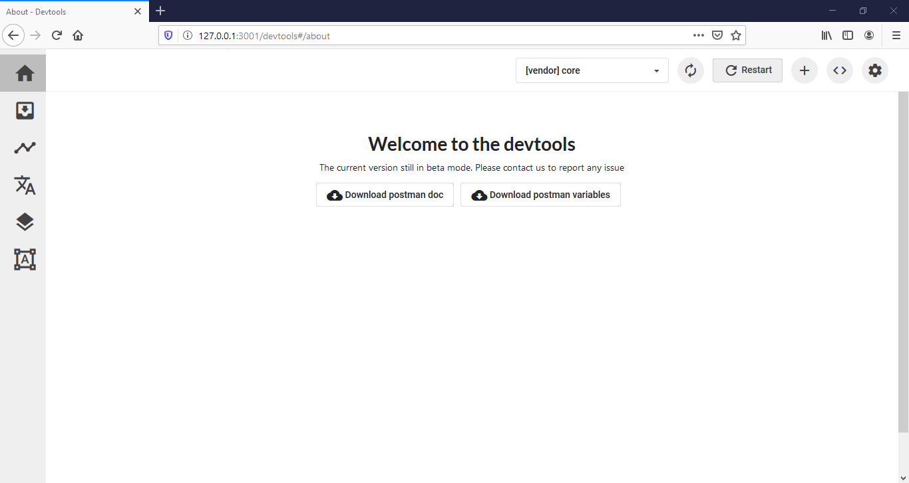

One of the first things you'll notice is that devtools with two buttons; one that generates a [JSON](https://www.json.org/json-en.html) file that contains your [envirement viarialbles](link/to/env/vars) and the other generates the docs for the server code

## Generating Postman Documentaion

If you don't have Postman already Installed make sure to download it from this [link](https://www.postman.com/)

Then next step is to import the auto generated JSON files and import them at your newly created workspace

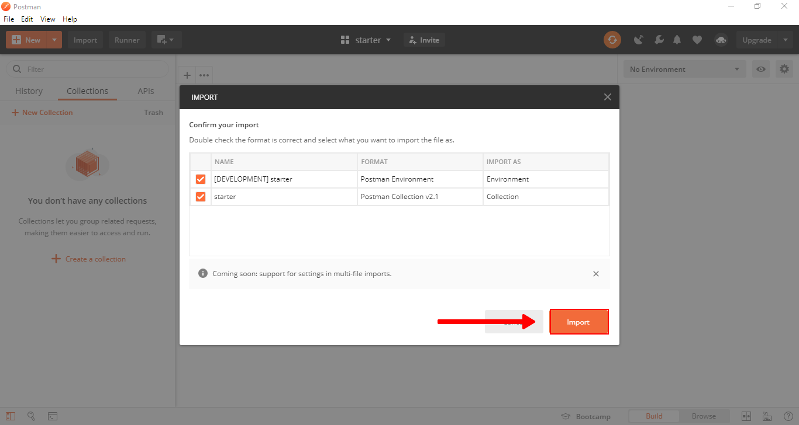

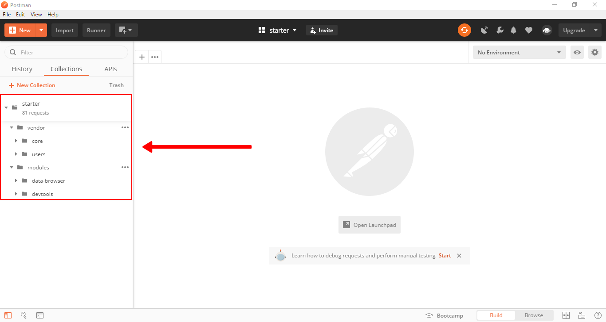
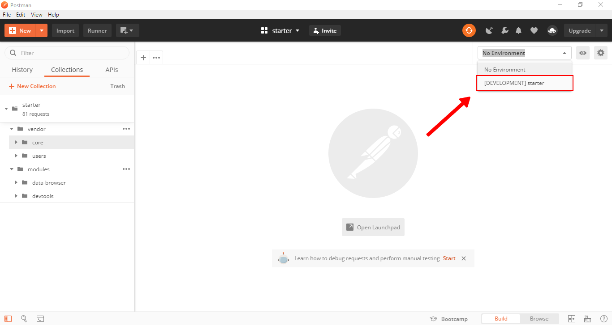

## Synchronizing your API with postman

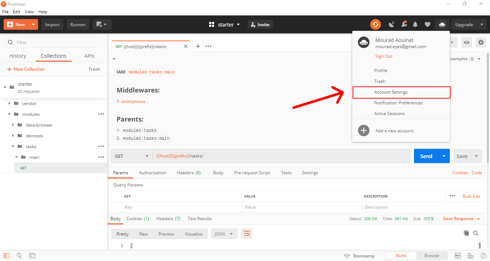

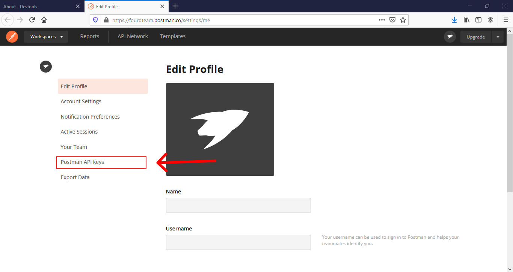

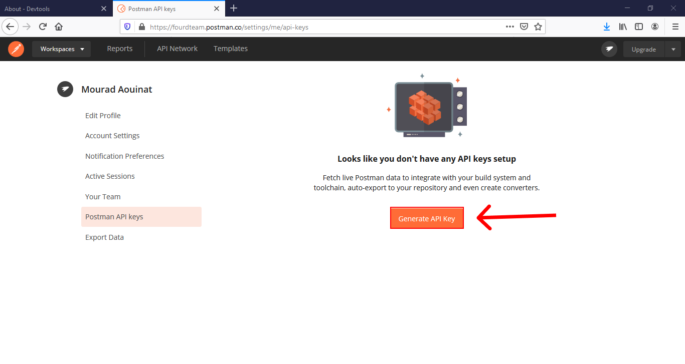

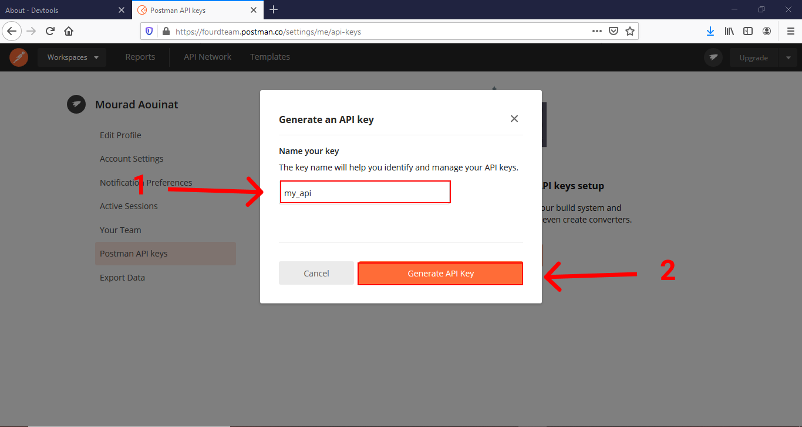

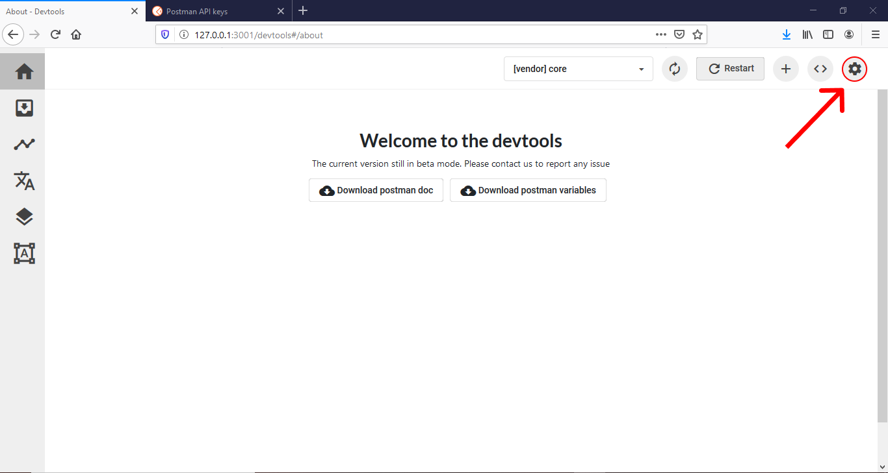

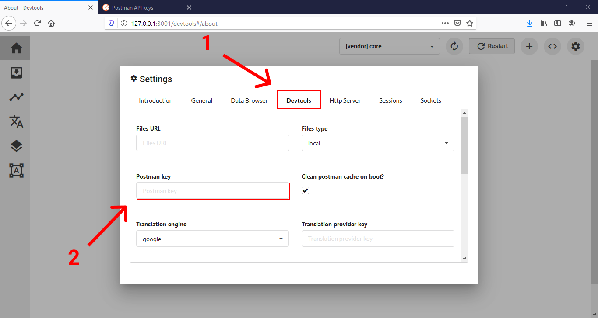

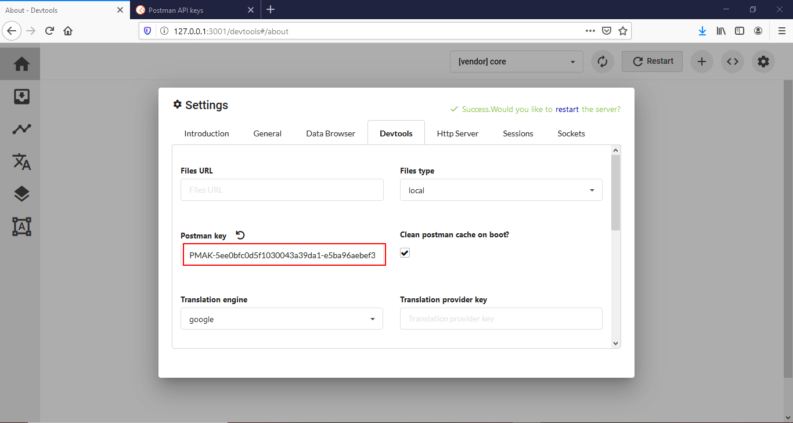

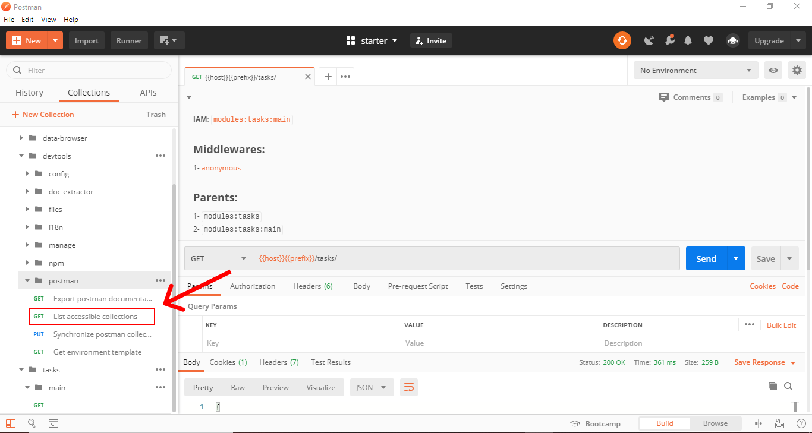

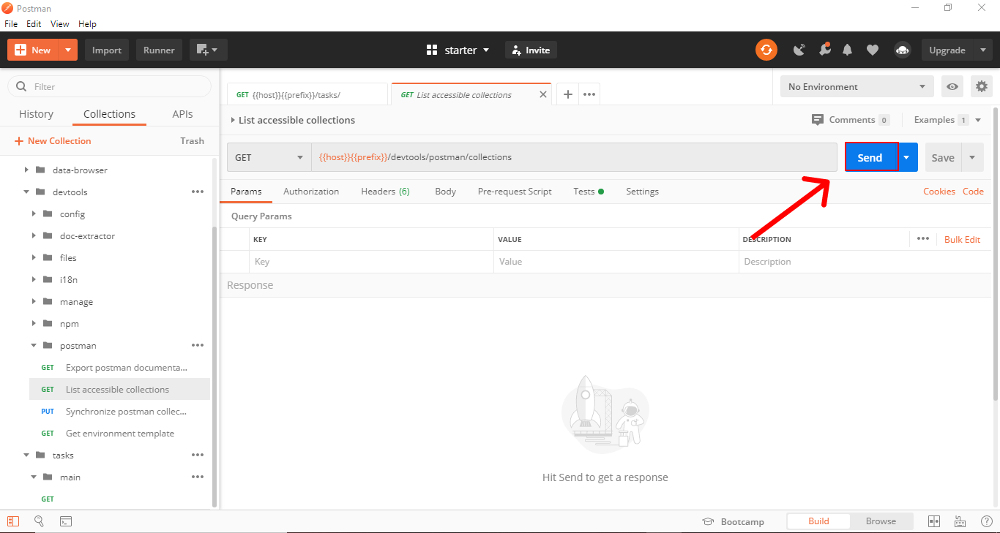

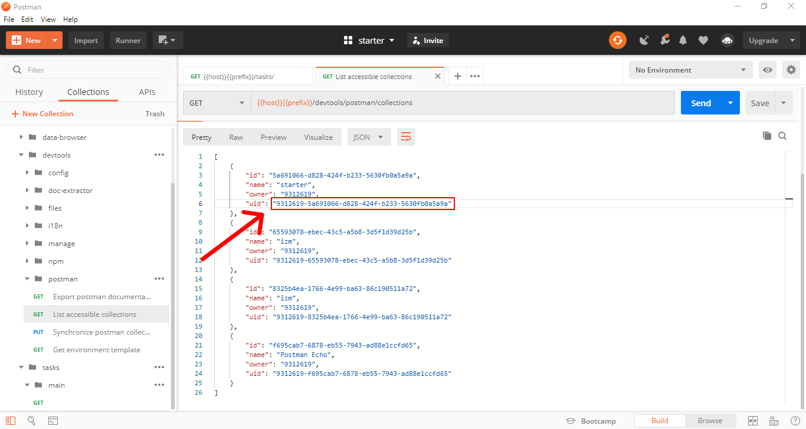

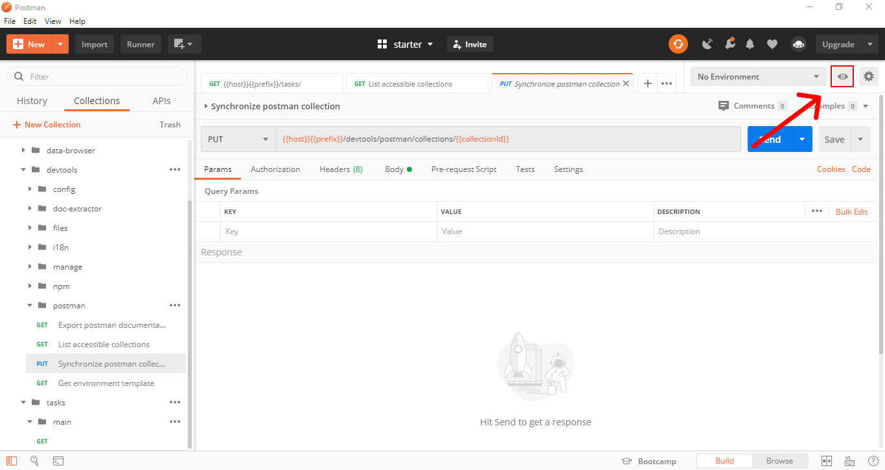

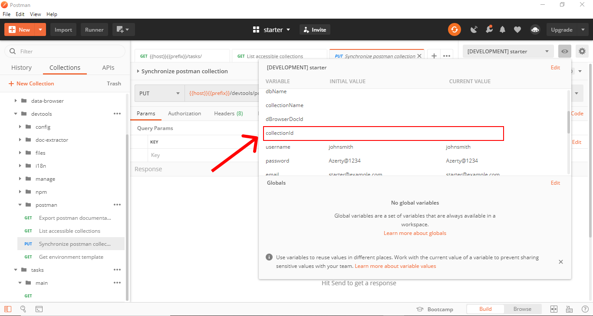

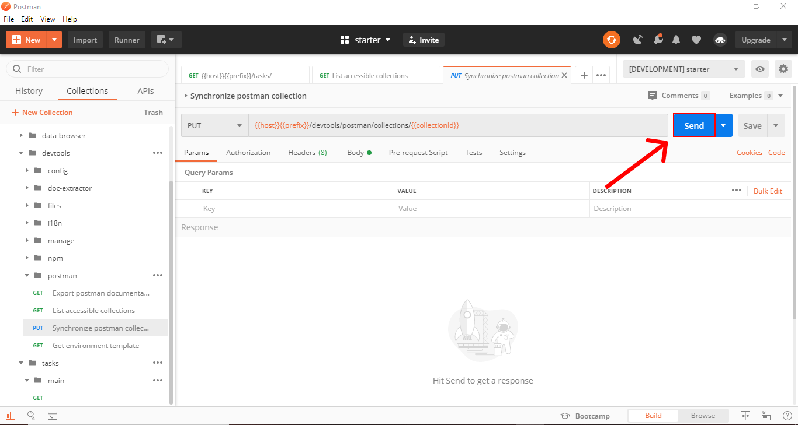

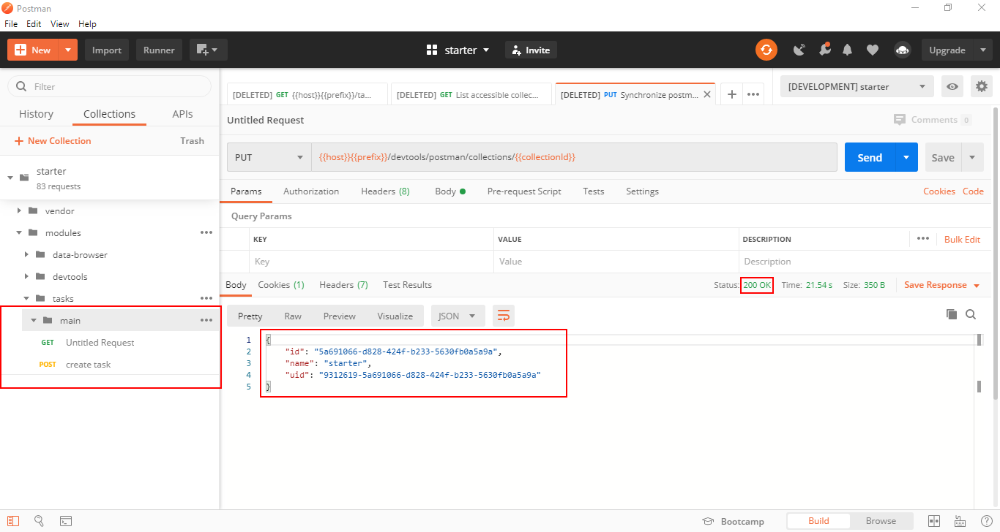
