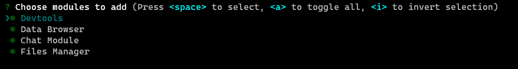
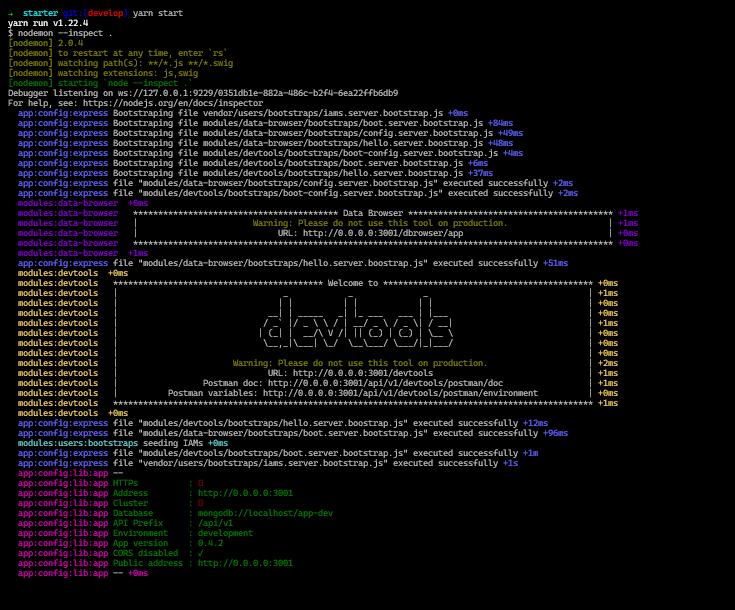
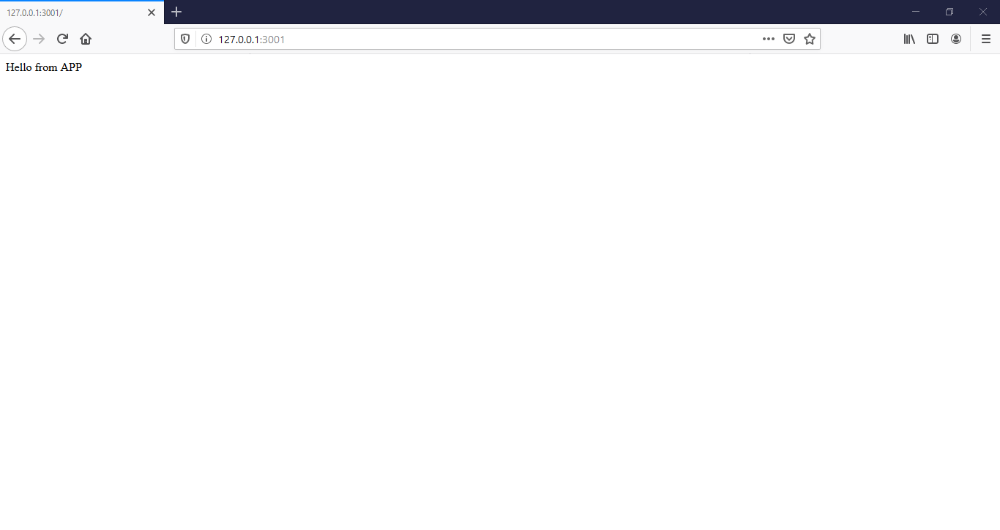

## Getting Started

> This tutorial assumes that you have both [node.js](https://nodejs.org/en/) and [mongodb](https://docs.mongodb.com/manual/reference/program/mongod/) installed on your machine

you can get up and running with izmjs by either running this command on your terminal:

```bash
npx izm
```

You will get promted to configure your app:


After that it'll ask you what [Functional Modules](/functional-modules) you want to use:



After you follow the instructions, and all the Dependencies have been Installed change the directories to the root of the project and then you can start your project by using:

```bash
npm start
```

or if you're using yarn

```bash
yarn start
```

when the App starts you should see something like this on the terminal Indicating that your App have been started successfully



Congratulations you've successfully sat up izm and you can see your app at the port you've chosen for it on the browser


